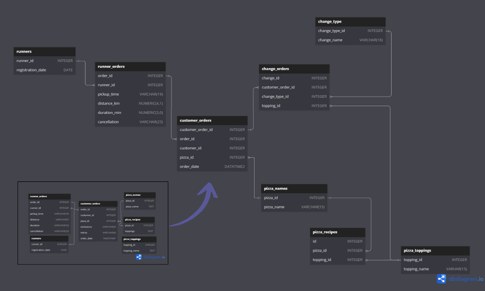
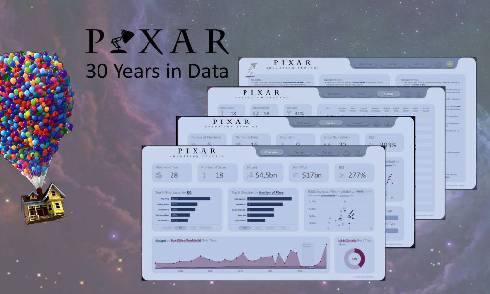
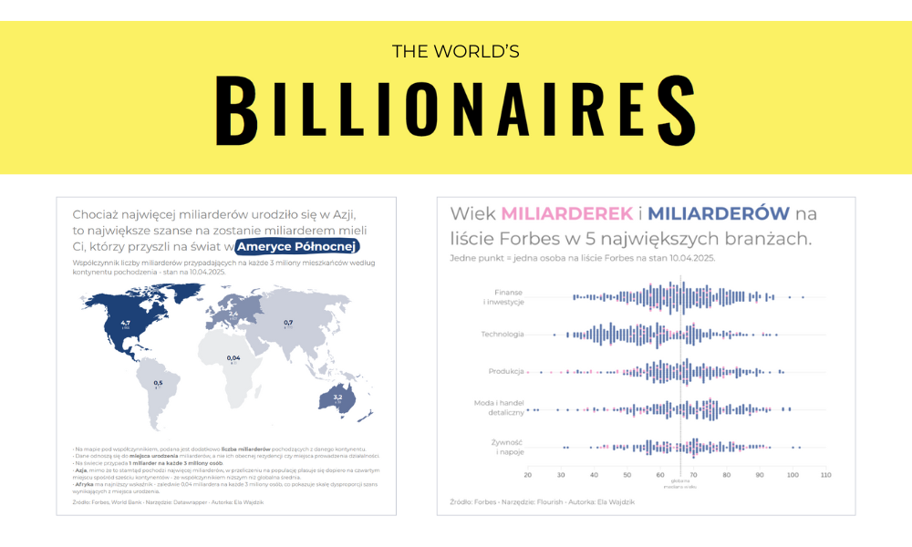
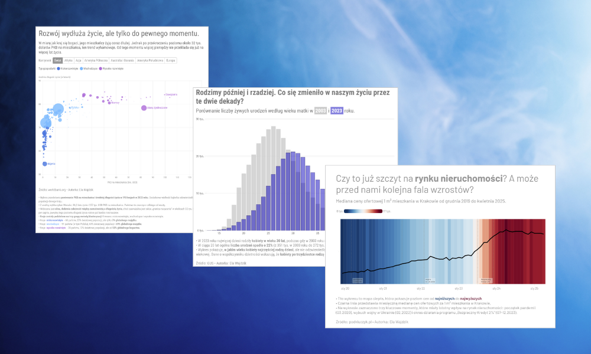

# Data Analyst Portfolio - Ela Wajdzik
This portfolio is a collection of data analysis and visualization projects that I have completed as part of my learning, personal interests, and passion. Through these projects, I develop my skills and deepen my knowledge to better understand the world around me and the mechanisms that drive it.

- **Email**: [ela.wajdzik@gmail.com](ela.wajdzik@gmail.com)
- **LinkedIn**: [linkedin.com/elawajdzik](https://www.linkedin.com/in/elawajdzik/)

<!-- ## Achievements -->

## Projects

 **[Pizza Runner Database Cleaning Process](https://github.com/ElaWajdzik/SQL_Challenge_Case_Study_2---Pizza-Runner/blob/main/Cleaning%20Process%20and%20E.%20Bonus%20Questions.md#-database-cleaning-process)**

Cleaned and preprocessed the Pizza Runner dataset to fix null values, inconsistent formats, and incorrect entries. Key steps: standardizing text, handling missing data, splitting comma-separated values, and correcting errors. This ensured a structured, high-quality dataset for accurate SQL analysis and insights into Pizza Runner’s operations.
  

#

 **[Pixar Movie Insights – Power BI Dashboard](https://github.com/ElaWajdzik/Ongoing_Projects/tree/main/Maven%20Pixar%20Challenge)**

Created an interactive [Power BI dashboard](https://app.powerbi.com/view?r=eyJrIjoiNGQwZmMwZTAtNTk0OS00MjNjLWI4NDItOTg3N2NiYTI0MGQwIiwidCI6IjNkZmU5YWI2LTgxYmYtNDkxYy1iNjcwLTAxYzgyNGEwOWUxOSJ9) to explore Pixar’s 30-year journey through a data-driven lens. As part of the Maven challenge, this project combines storytelling with visual analysis, highlighting trends in ratings, box office, and release history.  

# 

 **[The World’s Billionaires - Data Collection and Analysis](https://github.com/ElaWajdzik/Ongoing_Projects/blob/main/Jupyter%20Notebook/Miliarderzy%20Forbes.ipynb)** 🇵🇱

Collected and processed real-time billionaire data from the Forbes API to explore global wealth patterns. Cleaned a dataset including net worth, origin, industry, and other attributes. Used Python for extraction and transformation, followed by [visual analysis](https://github.com/ElaWajdzik/Ongoing_Projects/blob/main/%2352wykresy2025/03%20-%20miliarderzy%20Forbes.md) using Datawrapper, Flourish, and Canva.   

# 

 **[Polish Open Data - Chart Challenge](https://github.com/ElaWajdzik/Ongoing_Projects/blob/main/%2330DayChartChallenge/Week%201%20-%20Comparisons.md)** 🇵🇱

Ongoing personal challenge exploring Polish open data through visualizations. Using tools like Datawrapper and Flourish, I turn complex topics like age of motherhood, infectious disease trends, or housing prices-into clear, engaging visuals. Shared regularly on LinkedIn as part of #30DayChartChallenge.
   
# 

 **[#BI_NGO - Newborns left in hospitals](https://github.com/ElaWajdzik/Ongoing_Projects/tree/main/%23BI_NGO%20-%20Noworodki%20opuszczone%20przez%20rodzic%C3%B3w)** 🇵🇱

This project explores cases of newborns abandoned in hospitals, analyzing demographic, temporal, and regional trends. By identifying key patterns, it aims to support NGOs and policymakers in creating targeted interventions, improving social care systems, and preventing abandonment through data-driven solutions.

<!--
**[Clique Bait Online Store Analysis](https://github.com/ElaWajdzik/SQL_Challenge_Case_Study_6---Clique-Bait?tab=readme-ov-file#business-case)**

This project examines customer behavior on the Clique Bait online seafood store, focusing on funnel fallout rates and campaign effectiveness. By analyzing user interactions across multiple datasets, it evaluates conversion rates and provides insights into product views, cart additions, and purchases, emphasizing the impact of marketing campaigns.
-->

<!--
# Ongoing_Projects
A collection of diverse ongoing projects showcasing analytical and technical skills. This repository includes explorations in various technologies and domains, reflecting a dynamic and data-driven approach to problem-solving.

Projekt | opis
--- | ---
[PL BI_NGO - Newborns left in hospitals](https://github.com/ElaWajdzik/Ongoing_Projects/tree/main/%23BI_NGO%20-%20Noworodki%20opuszczone%20przez%20rodzic%C3%B3w) | Analiza opuszczeń i żywych urodzeń w Polsce w latach 2008–2023. Projekt przygotowany w ramach #BI_NGO dla Fundacji Gajusz
[#52wykresy2025](https://github.com/ElaWajdzik/Ongoing_Projects/tree/main/%2352wykresy2025) | [Populacja i powierzchnia największych miast Polski w latach 1939 a 2023.](https://github.com/ElaWajdzik/Ongoing_Projects/tree/main/%2352wykresy2025#wykres-1-4-zmiana-populacji-i-powierzchni-sze%C5%9Bciu-najwi%C4%99kszych-miast-polski-po-ii-wojnie-%C5%9Bwiatowej)
[#52wykresy2025](https://github.com/ElaWajdzik/Ongoing_Projects/tree/main/%2352wykresy2025) | [Samobójstwa w Polsce – jak zmieniała się sytuacja w latach 1999–2024?](https://github.com/ElaWajdzik/Ongoing_Projects/tree/main/%2352wykresy2025#wykres-5-11-samob%C3%B3jstwa-w-polsce--jak-zmienia%C5%82a-si%C4%99-sytuacja-w-latach-19992024)

-->
