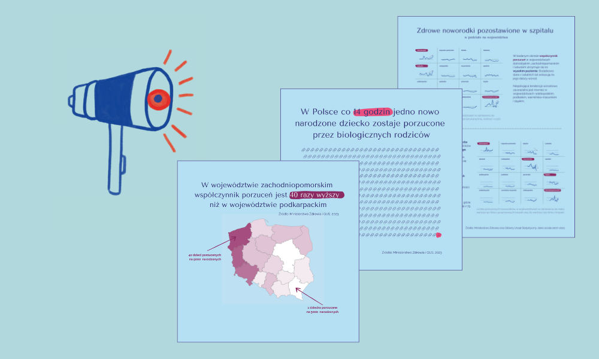

# Data Analyst Portfolio - Ela Wajdzik
This portfolio is a collection of data analysis and visualization projects that I have completed as part of my learning, personal interests, and passion. Through these projects, I develop my skills and deepen my knowledge to better understand the world around me and the mechanisms that drive it.

- **Email**: [ela.wajdzik@gmail.com](ela.wajdzik@gmail.com)
- **LinkedIn**: [linkedin.com/elawajdzik](https://www.linkedin.com/in/elawajdzik/)

<!-- ## Achievements -->

## Projects

 **[Pizza Runner Database Cleaning Process](https://github.com/ElaWajdzik/SQL_Challenge_Case_Study_2---Pizza-Runner/blob/main/Cleaning%20Process%20and%20E.%20Bonus%20Questions.md#-database-cleaning-process)**

Cleaned and preprocessed the Pizza Runner dataset to fix null values, inconsistent formats, and incorrect entries. Key steps: standardizing text, handling missing data, splitting comma-separated values, and correcting errors. This ensured a structured, high-quality dataset for accurate SQL analysis and insights into Pizza Runner’s operations.

#

**[#BI_NGO - Newborns left in hospitals](https://github.com/ElaWajdzik/Ongoing_Projects/tree/main/%23BI_NGO%20-%20Noworodki%20opuszczone%20przez%20rodzic%C3%B3w)**

This project explores cases of newborns abandoned in hospitals, analyzing demographic, temporal, and regional trends. By identifying key patterns, it aims to support NGOs and policymakers in creating targeted interventions, improving social care systems, and preventing abandonment through data-driven solutions.

#

<!--
# Ongoing_Projects
A collection of diverse ongoing projects showcasing analytical and technical skills. This repository includes explorations in various technologies and domains, reflecting a dynamic and data-driven approach to problem-solving.

Projekt | opis
--- | ---
[PL BI_NGO - Newborns left in hospitals](https://github.com/ElaWajdzik/Ongoing_Projects/tree/main/%23BI_NGO%20-%20Noworodki%20opuszczone%20przez%20rodzic%C3%B3w) | Analiza opuszczeń i żywych urodzeń w Polsce w latach 2008–2023. Projekt przygotowany w ramach #BI_NGO dla Fundacji Gajusz
[#52wykresy2025](https://github.com/ElaWajdzik/Ongoing_Projects/tree/main/%2352wykresy2025) | [Populacja i powierzchnia największych miast Polski w latach 1939 a 2023.](https://github.com/ElaWajdzik/Ongoing_Projects/tree/main/%2352wykresy2025#wykres-1-4-zmiana-populacji-i-powierzchni-sze%C5%9Bciu-najwi%C4%99kszych-miast-polski-po-ii-wojnie-%C5%9Bwiatowej)
[#52wykresy2025](https://github.com/ElaWajdzik/Ongoing_Projects/tree/main/%2352wykresy2025) | [Samobójstwa w Polsce – jak zmieniała się sytuacja w latach 1999–2024?](https://github.com/ElaWajdzik/Ongoing_Projects/tree/main/%2352wykresy2025#wykres-5-11-samob%C3%B3jstwa-w-polsce--jak-zmienia%C5%82a-si%C4%99-sytuacja-w-latach-19992024)

-->